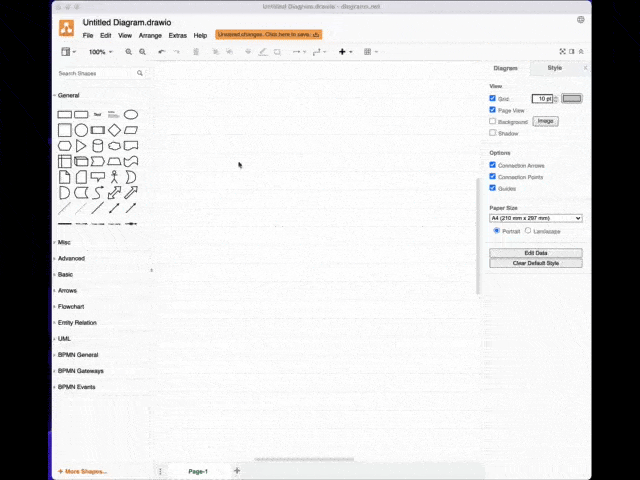

**NEW**: A better implementation of the Shape Library has been developed by the [Canadian Heritage Information Network](https://github.com/chin-rcip) and released in [this repository](https://github.com/chin-rcip/diagrams.net_libraries)

# CIDOC-CRM Shape Library

Shape library of CIDOC-CRM classes to be used with draw.io/diagrams.net

## How does it work

To use the shape library, open the diagram applications. Click on File > Open Library and select the XML from your computer or add it directly from github from the URI https://github.com/ncarboni/Shapes_CIDOC-CRM/raw/main/CIDOC-CRM.xml. Once added it will appear in your shape library, on the left side of the application. You can search for a class and add it right into your diagrams.

Enjoy!

