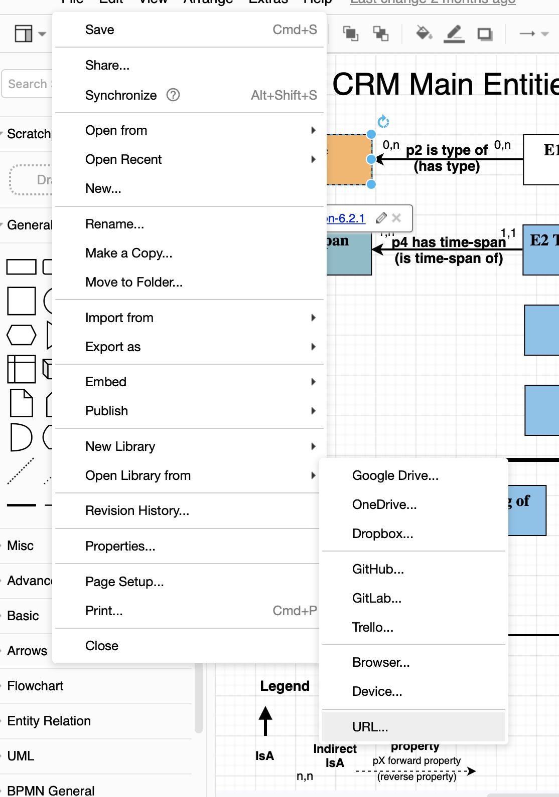

# CIDOC-CRM Shape Library

Shape library of CIDOC-CRM classes to be used with draw.io/diagrams.net

To use the shape library, open the diagram applications. Click on File > Open Library and select the XML from your computer or add it directly from github from the URI https://github.com/ncarboni/Shapes_CIDOC-CRM/raw/main/CIDOC-CRM.xml (see screenshot)

